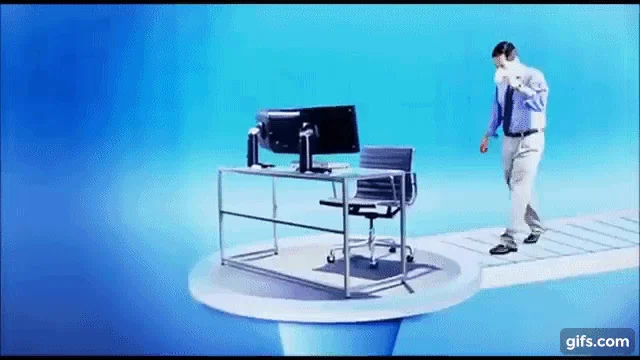

# CELERY MAN

**CINCO Identity Generator 2.5** · Your work is very important.

### [Enter the blue room ↗](https://celeryman.vaporware.gripe/)

An unofficial, interactive parody and fan homage to **Celery Man** from *Tim and Eric Awesome Show, Great Job!* Watch Paul arrive, take a seat at a real 3D computer, and spend an unreasonable amount of time asking it for a hat wobble.

Made by [kpm.fyi](https://kpm.fyi). A small internet toy with no accounts, analytics, saved data, or plans to become a platform.

<!-- screenshots:start -->
[](https://celeryman.vaporware.gripe/)

*The opening frame of the entrance excerpt used in the app. Original footage: Adult Swim / Tim & Eric.*
<!-- screenshots:end -->

## A very important morning

- **Walk in.** Paul's entrance cuts into the 3D room, then the camera brings you to the monitor. Stand up whenever you need a change of perspective.
- **Talk to the computer.** Type requests into a working retro desktop. Drag windows around, load a sequence, and let the machine patiently respond.
- **Get progressively less productive.** Fuzzy live-action dancers, synthesized music, disk chatter, a hat wobble, unnecessary dimensions, and an urgent call from your wife.
- **Take the shortcut.** Select **Run sketch** for roughly 90 seconds of guided nonsense, or interrupt at any time to take over.

| Tell the computer… | Very important result |
| --- | --- |
| `load Celery Man` | Your first sequence of the day |
| `4D3D3D3` | Additional, entirely necessary windows |
| `hat wobble` | Tayne demonstrates a new skill |
| `Flarhgunnstow` | Tiny Tayne takes over the terminal |
| `Oyster smile` | A portrait worth printing |
| `print Oyster` | Your extremely important printout |
| `nude Tayne` | An experimental preview, with a warning and censor effect |
| `more Celery Man` | A desktop full of Celery Man |

## Play locally

The [live demo](https://celeryman.vaporware.gripe/) needs no installation. To run your own copy:

```sh
npm run dev
```

Visit **http://localhost:4173**. Development requires Node.js/npm and Python 3; no package installation is needed. Any static file server can also serve `demo/dist/`.

Choose **Enter the blue room** to begin, or **Skip to computer** to get straight to work. **Replay entrance** starts the introduction again. Press **Esc** or **Stand up** to return to the room, then click the computer to sit down again.

WebGL is required for the room, and sound starts after a click. Reduced-motion settings skip the entrance film and disable the footer's glow animation. Optional voice commands depend on browser speech-recognition support and may use the browser's speech provider; typed commands always work.

<details>
<summary>Keyboard shortcuts and window controls</summary>

| Key | Action |
| --- | --- |
| `1` / `2` / `3` | Celery Man / Oyster / Tayne |
| `D` / `H` / `F` | 4D3D3D3 / hat wobble / Flarhgunnstow |
| `S` / `P` | Oyster smile / print Oyster |
| `Space` / `M` | Pause / mute |
| `/` / `?` | Focus the command line / help |
| `↑` / `↓` | Recall previous commands |
| `Esc` | Close a dialog, then stand up |

Drag, minimize, maximize, and close windows. Selecting a dancer restores its windows; `reset` restores the desktop. Standing up pauses playback.

</details>

## Source and builds

`demo/dist/` is the editable, directly deployable static app. There is no framework build.

| File | Purpose |
| --- | --- |
| `index.html`, `style.css` | Room controls and the 1024 × 768 retro desktop |
| `modules/app.js` | Commands, sketch tour, dialogs, and computer windows |
| `modules/entrance.js` | Entrance video, Skip/Replay, and camera handoff |
| `modules/room-model.js`, `modules/room-view.js` | Room geometry, camera transitions, and desktop projection |
| `modules/stage.js`, `modules/video-assets.js` | Canvas 2D character playback and media metadata |
| `modules/audio.js`, `modules/computer-fx.js` | Synthesized audio, typing, disk activity, and screen effects |
| `media/` | Local video, masked WebP loops, and provenance |
| `vendor/`, `fonts/` | Local dependencies and their licenses |

Run `npm run check` for lightweight JavaScript syntax checks. Run `npm run build` to generate the self-contained `celery-man.html`; the dependency-free bundler embeds runtime media for offline use. Keep generated downloads out of source commits. The legacy `modules/dancer.js` is retained for reference and is not used at runtime.

<details>
<summary>Capture the README screenshots</summary>

The optional capture helper opens the standalone app in Chromium, visits the room and computer, and captures three views without browser chrome or local paths. It adds the images to `docs/screenshots/` and replaces the entrance still above with the finished gallery. It requires a machine that can launch a browser with WebGL.

```sh
npm install --no-save --package-lock=false playwright@1.61.1
npx playwright install chromium
npm run screenshots
```

Playwright is only used for this documentation task; the app itself remains dependency-free to run. Review the resulting images before committing them.

</details>

## Cloudflare hosting

`wrangler.jsonc` deploys `demo/dist/` directly to Cloudflare Workers Static Assets at **https://celeryman.vaporware.gripe**. No application Worker, framework build, or running development server is needed. Forks should change the Worker name and custom domain before deploying.

Authenticate with a Cloudflare account that owns the domain, then deploy:

```sh
npx wrangler@4.106.0 login
npm run deploy
```

Wrangler configures the custom domain and Cloudflare provisions its DNS record and HTTPS certificate. Resolve any existing record or Worker ownership conflict before replacing it. Credentials stay in Wrangler's user configuration; do not add account IDs, tokens, or local infrastructure details to this repository.

## Credits and intent

The original [Celery Man sketch](https://www.youtube.com/watch?v=a8K6QUPmv8Q) is by Tim and Eric, features Paul Rudd, and was released by Adult Swim. This project is not affiliated with or endorsed by Tim and Eric, Paul Rudd, or Adult Swim.

This is a parody and fan homage made with fair-use intent. Short excerpts of the original performance supply the fuzzy dancers, portraits, and entrance. The entrance retains its full frame and source watermark. Attribution, source links, and processing details are recorded in [performance sources](demo/dist/media/SOURCES.md) and [entrance source](demo/dist/media/ENTRANCE-SOURCE.md). The original footage remains subject to its owners' rights and is not offered under an open license.

The room, interface, and effects are recreated in code. Music, computer speech, and computer noises are synthesized; the app does not play the original sketch's audio. Preserve the separate license files for Three.js and the bundled fonts.
